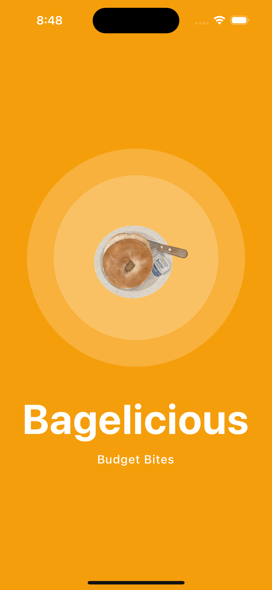
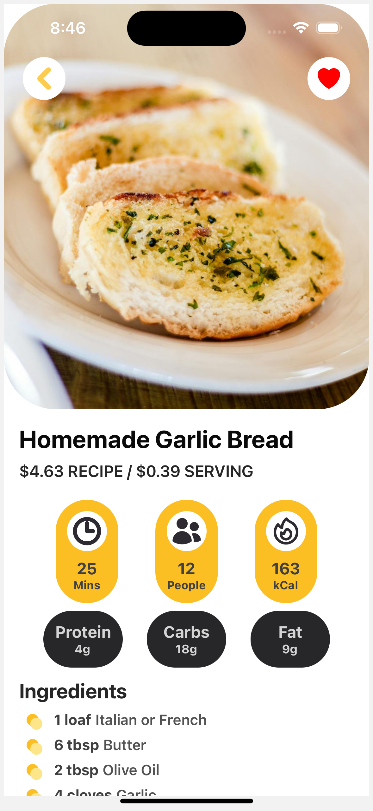
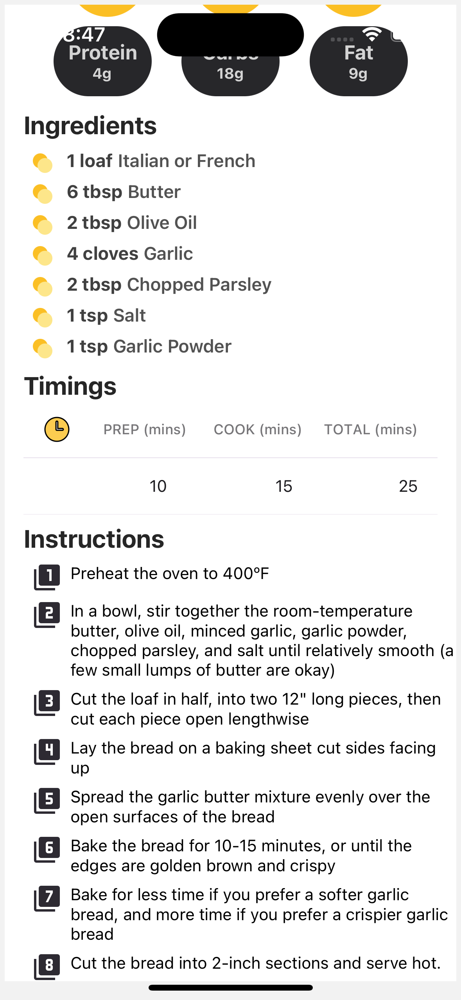

# Welcome to Bagelicious! 👋

## Preview
| Splash | Home Page | Recipe Card | Recipe Card Details
|||||

## Get started

1. Install dependencies

   ```bash
   npm install
   ```

2. Start the app

   ```bash
    npx expo start
   ```
